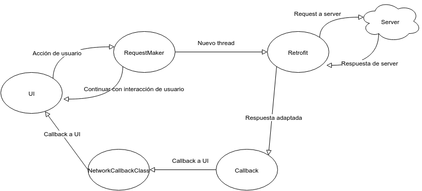

Documentación Técnica
*************************

General
===========

REST API
----------
.. literalinclude:: ../../API.txt
	:language: python

Estructura Base de Datos
-------------------------
.. literalinclude:: ../../DBStructure.txt

Ambiente de Desarrollo e Integración Continua
------------------------
Para desarrollar el presente proyecto, se decidió utilizar *C-Lion* como IDE para desarrollar el código *C++*, ya que aparte de los beneficios generales de usar un IDE, este permite integrar el repositorio y es, a nuestro entender, de los mejores para escribir en lenguaje *C++*.

Se utilizó la herramienta *CMake* para la compilación del proyecto.

Todas las pruebas y la compilación/ejecución del servidor fueron ejecutadas en Docker, de manera que todos los integrantes del equipo estuvieran trabajando sobre un ambiente con las mismas características. Ya que el uso de Docker nos permitió poseer a todos una máquina virtual de las mismas características, de modo que si la funcionalidad era exitosa para uno de los miembros, también lo debía ser para los demás

Además, se configuró un servidor de integración continua utilizando Jenkins, en un servidor virtual alojado en DigitalOcean. De esta manera,
no era necesario tener una computadora prendida continuamente para que se corriera la integración. Nuestra intención
inicial era usar Travis, pero está limitado a repositorios de GitHub (el nuestro está alojado en BitBucket), y las
diferentes soluciones posibles nos parecieron complicadas, e implementarlas no tenía sentido.

Dentro del servidor virtual, Jenkins fue instalado como una instancia de Docker. Luego, se crearon usuarios para cada
integrante del proyecto, y se configuró un hook en BitBucket para que enviara un http request a Jenkins cada vez que
entraba un push al repositorio del servidor. Luego, Jenkins se encarga automáticamente de clonar el repositorio con el
estado actual, y correr los dos comandos necesarios para correr todos los test del sistema: runPythonTestsInDocker.sh y runTestsInDocker.sh

El problema grave que tuvimos es que como Jenkins estaba corriendo en Docker y nuestra aplicación también, lo que se daba
era un caso de Docker-In-Docker, lo cual no está soportado por Docker. La solución que aplicamos fue configurar el
Jenkins de Docker para que su archivo /var/run/docker.sock, archivo donde escribe para crear nuevas instancias, fuera
el homólogo del servidor virtual. De esta manera, es el servidor virtual (el host) quien corre la nueva instancia de
Docker con FDrive, a pedido de Jenkins (el guest).

Esto lo logramos aplicando el siguiente comando para crear el jenkins::

   docker run -d -p 50000:8080 --name fiuba7552_jenkins -v /var/jenkins_home:/var/jenkins_home -v /var/run/docker.sock:/var/run/docker.sock jenkins

El servidor de integración está disponible para visitarlo en http://ci.fiuba7552.tk

Servidor
===========

Librerías y compilación
------------------------

Arquitectura/Diseño
------------------------
Podemos dividir el diseño del proyecto en varias partes

Manejo de Requests
+++++++++++++++++++
Se posee un requestHandler que analiza la request recibida por el server, una vez recibida y analizado su contenido envía los datos pertinentes de la request al manejador correspondiente.

Para más datos sobre los distintos tipos de requests permitidas, y la estructura de las mismas vea la sección `REST API`_

Managers
+++++++++
Para los distintos tipos de request se poseen manejadores que, utilizando los datos recibidos realizan la operación que se deba realizar.

Decidimos dividir los manejadores según los distintos tipos de requests que teníamos: usuarios, archivos, carpetas.

Modelo Base
+++++++++++
Esta es la parte más baja del diseño, se representaron los modelos de las distintas estructuras necesarias:
	* Usuario
	* Archivo
	* Carpeta
	* Búsqueda

Base de datos
++++++++++++++
Por otro lado tenemos que destacar la utilización de la base de datos.

Todos los datos se mantiene en una base de datos de tipo clave-valor. Se puede observar la estructura de la misma en el tópico `Estructura Base de Datos`_.

Cabe destacar la estructura generada para las búsquedas dentro de la base de datos, la misma la hicimos mediante un índice invertido, el cual se va generando ante agregado de nuevos archivos, o ante operaciones realizadas sobre los mismos (cambio de metadatos, compartida, eliminación, etc.). De este modo, si bien ante cada cambio hay que hacer modificaciones en los índices, las búsquedas se realizan de manera muy rápida.

Clases
------------------------
Generamos la misma subdivisión que en la sección previa, y explicamos las clases más importantes de cada sección

Manejo de Requests
+++++++++++++++++++
	* Clase RequestHandler: clase que analiza las distintas requests recibidas por el server. Las decodifica y, de ser una request válida, envía los datos al manejador correspondiente.

Managers
+++++++++
	* Clase FileManager: maneja todas las requests referentes a archivos, podemos citar algunas:
		* Subir/Descargar archivos.
		* Compartir/Descompartir archivos.
		* Eliminar archivos.
		* Cambiar la metadata referente a un archivo.
		* Compartir una carpeta (equivale a compartir todos los archivos dentro de dicha carpeta).
		
	* Clase FolderManager: maneja las requests referentes a carpetas:
		* Agregar carpetas nuevas en un determinado path.
		* Renombrar una carpeta.
		* Obtener todos los archivos de una carpeta.
		* Renombrar archivos dentro de una dada carpeta.		

	* Clase UserManager: maneja las requests referents a usuarios:
		* Agregar nuevos usuarios (Sign Up).
		* Loguear usuarios existentes (Log In).
		* Desloguear usuarios existentes (Log In).
		* Cargar los archivos pertenecientes a un usuario.

Modelo Base
+++++++++++
	* Clase User: Representa a un usuario.
		* Atributos: contiene sus datos personales.
			* Email
			* Nombre
			* Ubicación
			* Foto
			* Cuota para subir archivos.
		* Métodos
			* Setters/Getters
			* save/load
			* signup
			* login
			* logout

	* Clase File: Representa un archivo.
		* Atributos			
			* ID
			* Última versión
			* Owner
			* Metadata
		* Métodos
			* Setters/Getters
			* save/load
			* saveSearches: para generar el índice de las búsquedas.
			* addSharedUser: para compartir el archivo a un usuario.
			* eraseFromUser: para borrar un archivo.
			* recoverFromUser: para recuperar un archivo borrado.

	* Clase Folder: Representa una carpeta.
		* Atributos
			* user: usuario de esa carpeta.
			* fullName: nombre completo, incluido todo el path desde root.
			* folders: carpetas dentro de esa carpeta.
			* filesIds: IDs de los archivos dentro de esa carpeta.
			* filesNames: nombres de los archivos dentro de esa carpeta (se usa para chequear de manera rápida que no se agreguen archivos con el mismo nombre en dicha carpeta).
		* Métodos
			* Setters/Getters
			* addFolder
			* addFile
			* renameFolder			

Código
------------------------

Pruebas
------------------------

Cliente
===========

El cliente consta de una aplicación para Android(4.3+).

Como ambiente de desarrollo se utilizó Android Studio

Bibliotecas y compilación
------------------------

Para la implementación del cliente se hizo uso de las siguiente bibliotecas:

* Android SDK
  Provee todas las funcionalidades nativas de Android.
* Android Support Library
  Permite realizar aplicaciones con características de Android 5.0+ orientadas a versiones anteriores.
* Hdodenhof CircleImageView
  Biblioteca externa que adapta imagenes a imagenes circulares.
* Retrofit
  Provee un cliente http restful asi como tambien un json adapter para las consultas
* Getbase FloatingActionButton
  Biblioteca externa para incluir un "Floating action button", boton característico de material design.(Se        permiten crear menus y agregar algunos parametros que no están disponibles en el botón nativo)
* SLF4j
    Permite loggear a un archivo

La compilación está configurada por default gracias a Gradle desde Android Studio.

Arquitectura/Diseño
------------------------

La aplicación se desarrolló en torno al patrón MVC aunque también se utilizaron otros patrones de diseño como Singleton y Proxy.

Activities controlan la interacción con el usuario mientras que Retrofit se encarga de la interacción con el servidor. Además se cuenta con clases intermediarias que transforman y manipulan la información.

La comunicación con el servidor se hace mediante request http restful y con bodies en formato json de ser necesarios.

Si bien existen activities de tanto de registro, como de logeo y configuración, la mayor parte de la interacción ocurre en la activity principal, la que representa el almacenamiento de los archivos de usuario.

El flujo de la aplicación es el siguiente:

|interaction|

Para cada interacción del usuario con la UI que genere una request, hay una llamada a una RequestMaker que se encarga de crear un nuevo thread con la request a realizar el server.
Mientras que en background Retrofit se encarga de adaptar la request, según su tipo, al retornar de la llamada a RequestMaker puede que el cliente se bloquee esperando la respuesta del servidor(ej: Esperando a recibir los archivos de la carpeta seleccionada) o que habilite la interacción con el usuario(Ej: Descargando un archivo).

Retrofit permite adaptar clases internas a requests http restful y json, por lo que hay una capa de abstracción para el intercambio de la información. Todas las request se pueden modelar con clases privadas. El mismo caso se da para las respuestas del servidor, donde un Adapter transforma las Server responses a clases propias para tener un fácil acceso a la información recibida.

Cuando el thread de connexion recibe la server response, se ejecutan sus callbacks. success() o failure() si la connexion fue exitosa o fallida.
En este paso entra en juego NetworkCallbackClass. Dado que las cada respuesta del server significa una actualizacion de la iterfaz de usuario, NetworkCallbackClass permite realizar esa conexion de callback-GUI. Es una interfaz con sus métodos implementados por la Vista, pero llamados por los callbacks de conexión. Por este medio se intercambia la información para adaptar la interfaz gráfica.

Clases Principales
------------------------

Activities
+++++++++++++++++

La aplicación cuenta de 5 activities:
* MainActivity para la pantalla principal.
* LoginActivity para la pantalla de logueo.
* RegisterActivity para la pantalla de registro.
* DriveActivity para la pantalla de drive(visualización de archivos y carpetas, administración de los mismos, etc).
* ConfigurationActivity para la pantalla de configuración.

**DriveActivity**
Permite visualizar el drive, con sus carpetas **FolderCard** y sus archivos **FileCard**. La información de los archivos se almacenan en **FileMetadata** mientras que la ruta de las carpetas se mantiene por **Path**.

Cards
++++++++

Tanto **FileCard** como los **FolderCard** cuentan con clases "Adapters" que se encargan de transformar información en forma de *List* a las cards que se muestran en la pantalla.

**FileCard** tiene como atributo **FileMetadata** donde se alamacena la informacion del archivo::

   public class FileMetadata {

       public String name,extension,owner,lastUser,lastModified,pathInOwner;
       public int id,size,lastVersion;
       public List<String> tags,users;

   }

Database
++++++++++

Para la persistencia de información (ej: no tener que registrarse cada vez que se abre la aplicación) se usa **Database** , un singleton que guarda y recupera datos básicos del usuario en forma de clave-valor.

TypedInputStream
++++++++++++++++++

Se encarga de transformar un archivo de la memoria interna a un tipo de datos compatible con retrofit para poder enviar al servidor. Además provee feedback de la cantidad de datos que fueron enviados para poder actualizar una barra de progreso a medida se suban los archivos.

ErrorDisplay
+++++++++++++++++

Singleton que muestra en pantalla mensajes de error o warnings.

RequestMaker
++++++++++++++++++

RequestMaker se encarga de transfromar la informacion capturada de la GUI a request http gracias a **ServiceGenerator** y a definir los callbacks que se ejecutan cuando se recibe la respuesta del servidor.

Está implementado con un patrón singleton y se accede desde varios puntos de la aplicación, abstrayendo y encapsulando todas las request que realiza el programa.

Código
------------------------
A continuación un ejemplo que muestra el flujo de información de la app.

* Acceso a una carpeta

Desde la ventana del drive se presiona una **FolderCard**. El evento es capturado por el listener::

  private void setCardsListeners(){
          .
          .
          .
          .
          this.recyclerFoldersView.addOnItemTouchListener(new RecyclerItemClickListener(getApplicationContext(), new RecyclerItemClickListener.OnItemClickListener() {

              @Override
              public void onItemClick(View view, int position) {
                  TextView clickedFolder = (TextView) view.findViewById(R.id.folder_name);
                  RequestMaker.getInstance().getUserFiles(activityCallback, email, token, path.goTo(clickedFolder.getText().toString()));
                  toggleUi(false);

              }

          }));

      }

Se realiza una llamada a **RequestMaker** para que realice la request al servidor

RequestMaker::

  public void getUserFiles(final NetworkCallbackClass activityCallback,String email,String token,String path){

          GetUserFilesService client = ServiceGenerator.createService(GetUserFilesService.class,baseUrl);

          client.getUserFiles(email, token, path, new Callback<GetUserFilesAnswer>() {
              @Override
              public void success(GetUserFilesAnswer getUserFilesAnswer, Response response) {
                  if (getUserFilesAnswer.result)
                      activityCallback.onGetUserFilesSuccess(getUserFilesAnswer);
                  else {
                      activityCallback.onRequestFailure(getUserFilesAnswer.errors);
                  }
              }

              @Override
              public void failure(RetrofitError error) {
                  activityCallback.onConnectionError();
              }
          });

      }

Una vez que se llama a client.getUserFiles(... ya se creara un nuevo thread. El que le sigue define los callbacks que se ejecutarán una vez que el server responda.

En este caso, la adaptación de la request la hace **GetUserFilesService**::

  public interface GetUserFilesService {
      @GET("/userfiles")
      void getUserFiles(@Query("email") String email,@Query("token") String token,@Query("path") String path,Callback<GetUserFilesAnswer> callback);
  }

Dentro del los callbacks de la request se llama a activityCallback, una instancia de **NetworkCallbackClass**, donde se realiza la conexión con la GUI::

  activityCallback.onGetUserFilesSuccess(getUserFilesAnswer);

**NetworkCallbackClass**::

  public void onGetUserFilesSuccess(GetUserFilesAnswer answer){
          callback.onGetUserFilesSuccess(answer);
      }

El método de la interfaz está implementado en **DriveActivity**

**GetUserFilesAnswer** es la clase a la cual se adaptan las respuestas de esta request::

    public class GetUserFilesAnswer {

        public static class Content {
            public List<Integer> files;
            public List<String> folders;
        }
        public List<String> errors;
        public boolean result;
        public Content content;

    }

En caso de un error en la conexión, se llama a::

     activityCallback.onConnectionError();

Con su callback también implementado en **DriveActivity** donde se llama a **ErrorDisplay** para mostrar el error recibido::

  public void onConnectionError(){
          ErrorDisplay.getInstance().showMessage(context, view, "Connection error,check configured ip or try again later");
          toggleUi(true);
      }

