.. @formatter:off

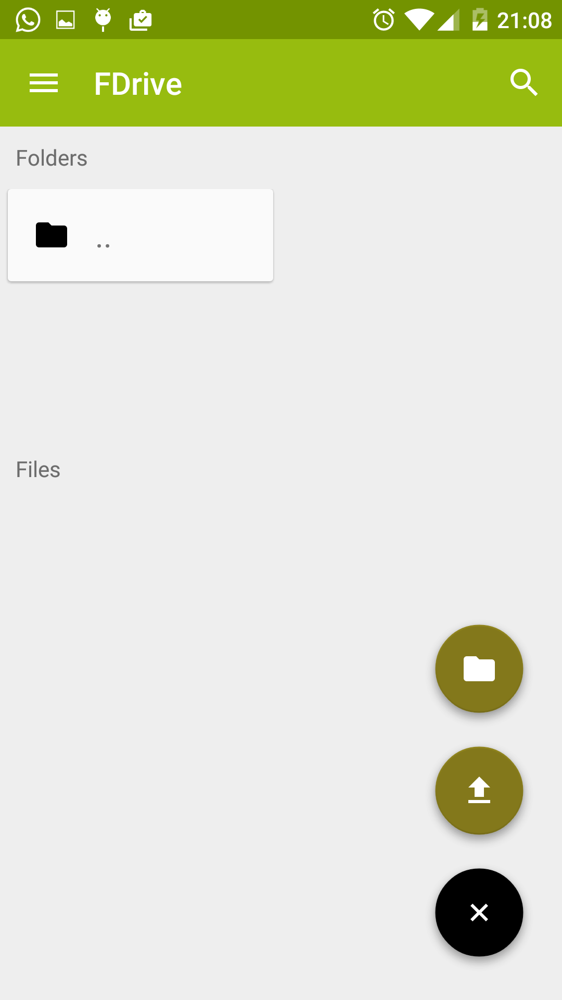

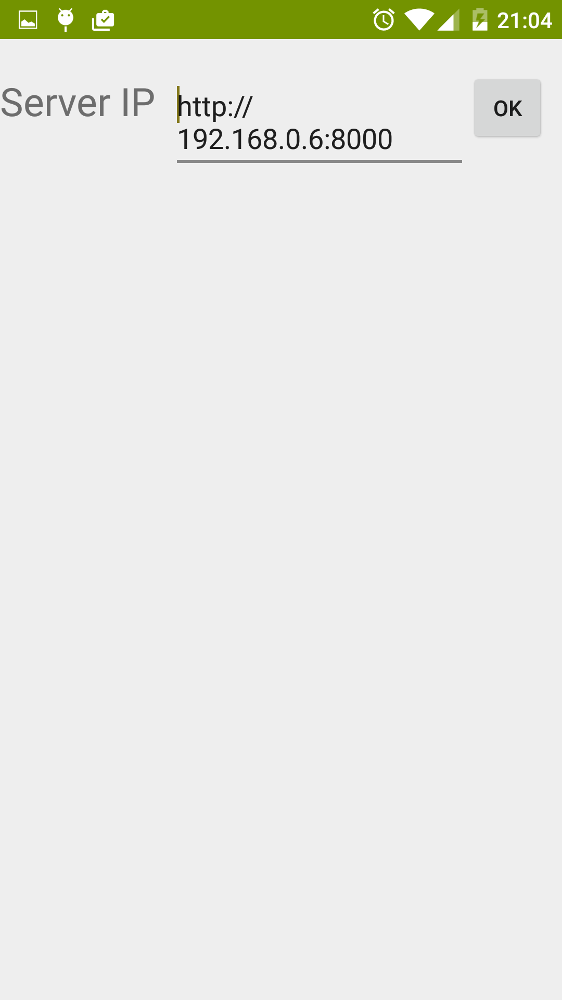

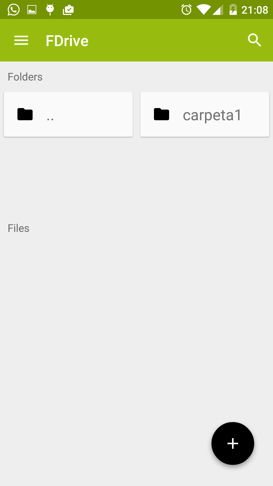

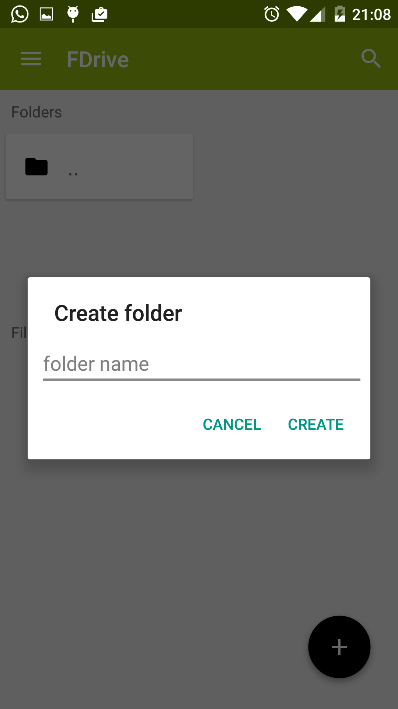

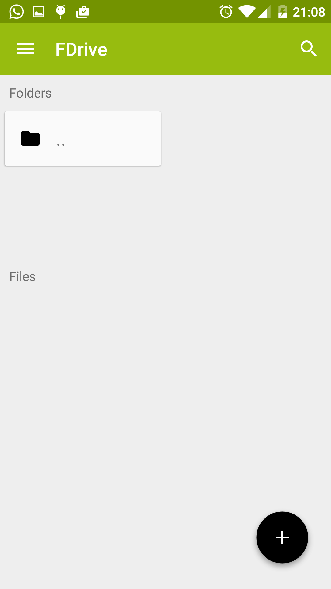

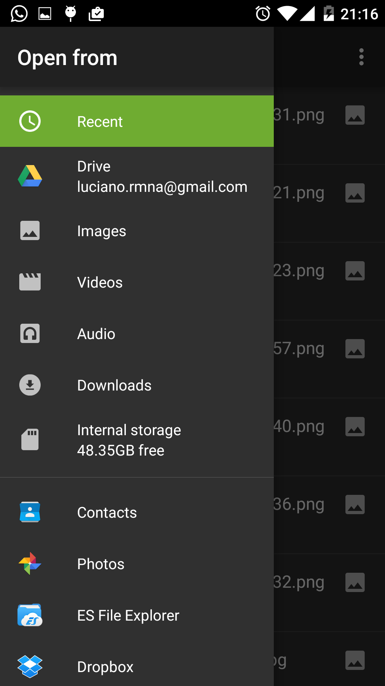

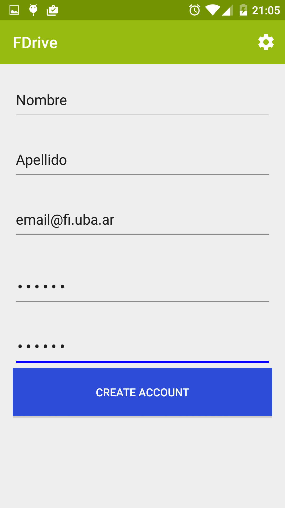

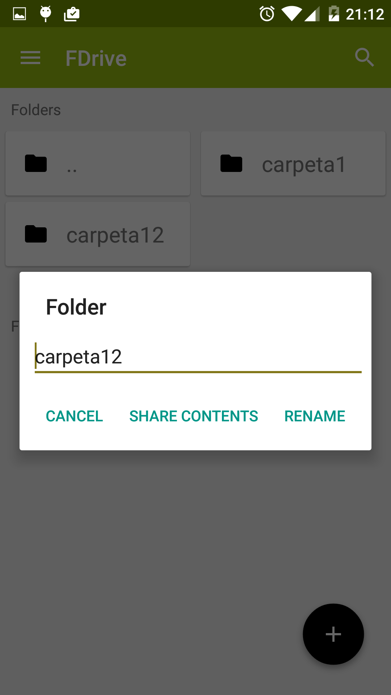

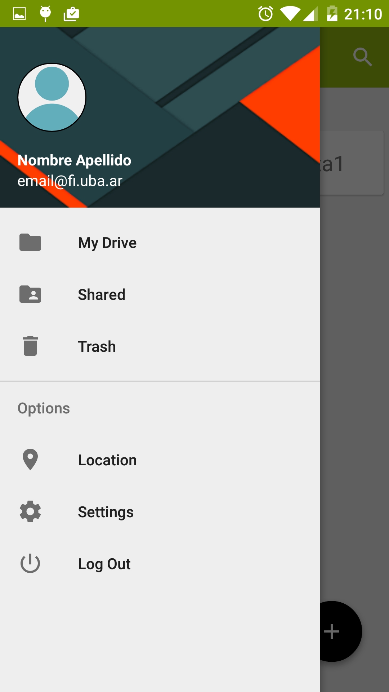

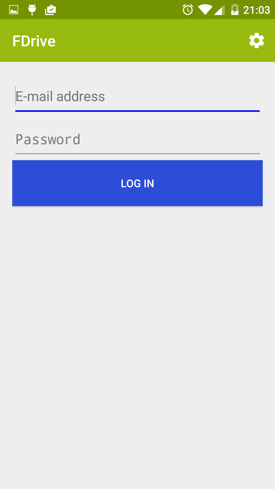

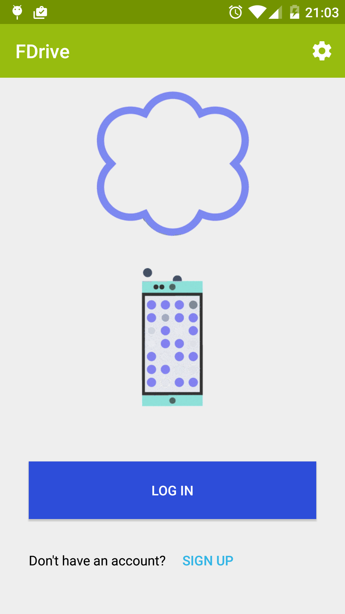

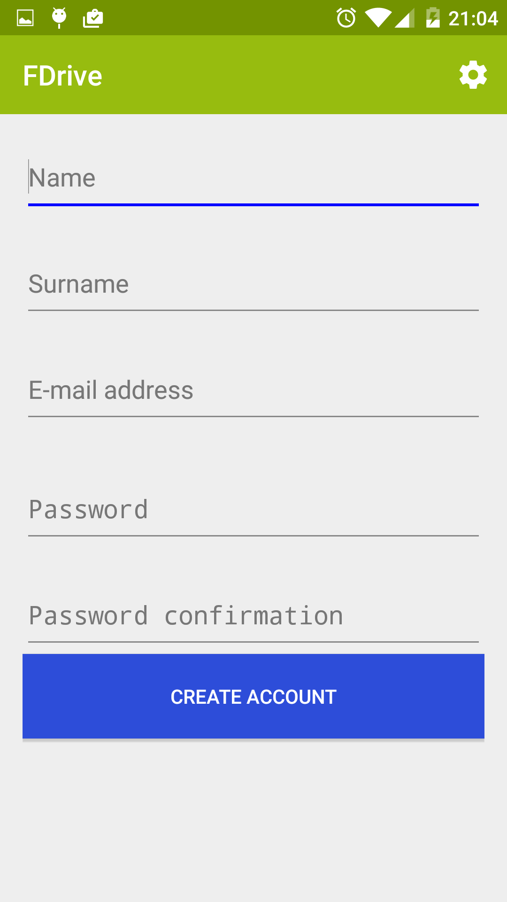

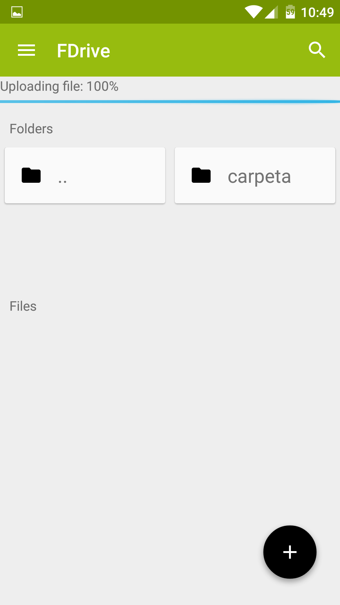

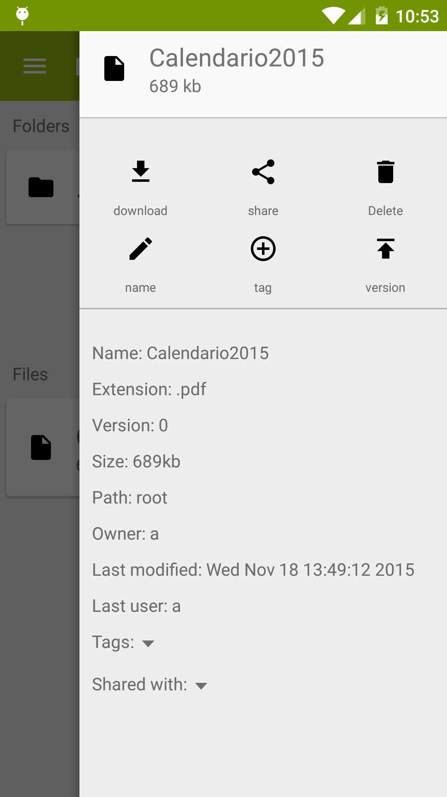

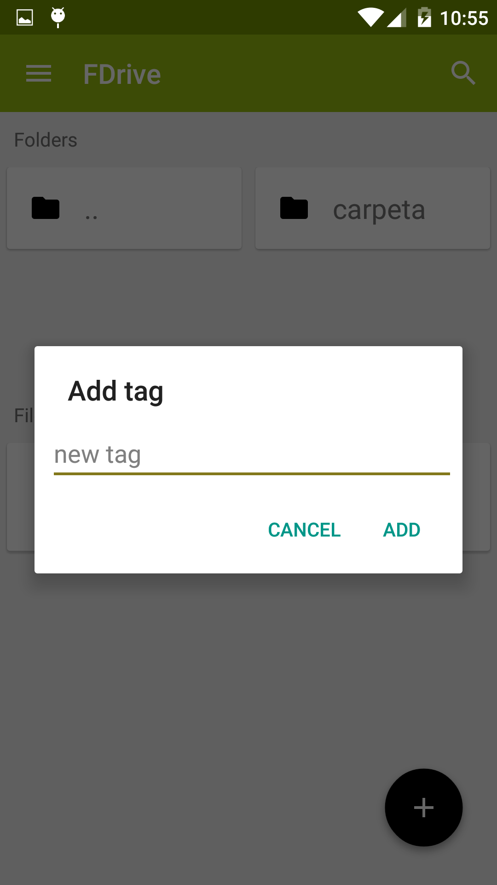
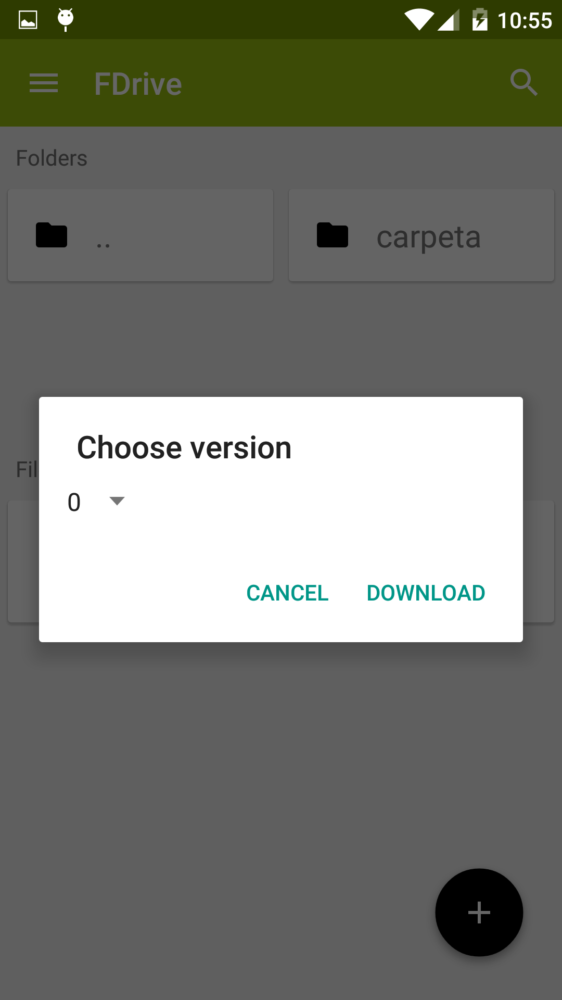
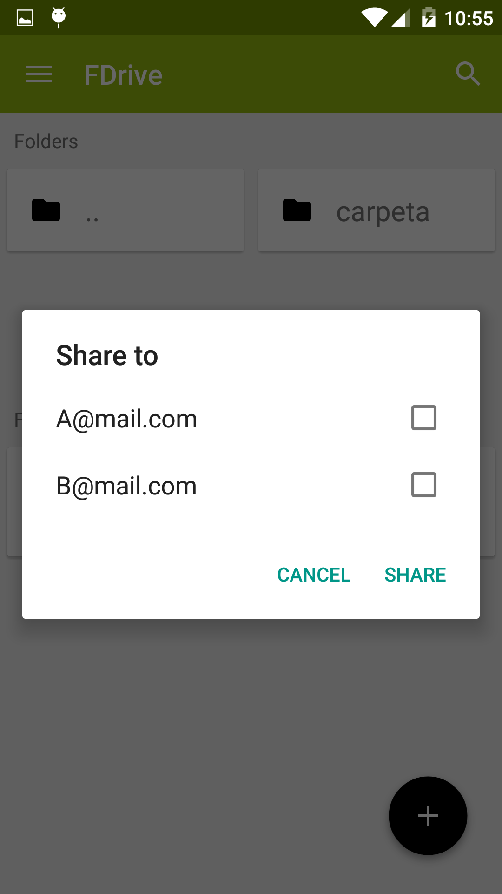
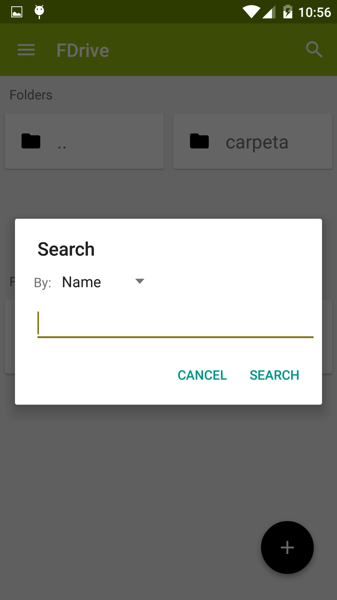

.. |menu-icon| image:: images/menu-icon.png

.. |conf-icon| image:: images/settings-icon.png

.. |edit-icon| image:: images/edit-icon.png

.. |share-icon| image:: images/share-icon.png

.. |circle-icon| image:: images/circle-plus-icon.png

.. |plus-icon| image:: images/plus-icon.png

.. |delete-icon| image:: images/delete-icon.png

.. |download-icon| image:: images/download-icon.png

.. |folder-icon| image:: images/folder-icon.png

.. |shared-folder-icon| image:: images/folder-shared-icon.png

.. |logout-icon| image:: images/logout-icon.png

.. |search-icon| image:: images/search-icon.png

.. |location-icon| image:: images/location-icon.png

Manual del Usuario
*************************

FDrive es una aplicación de cloud storage. Permite almacenar archivos en un servidor externo, administrarlos, compartirlos y mantener versiones de los mismos.

La aplicación está disponible para Android(4.3+).

Features incluídos
============================

La aplicación permite tener una cuenta de usuario.

Cada usuario podra:

* Subir archivos a su espacio privado, por primera vez o nuevas versiones del mismo archivo.
* Modificar la información del archivo(renombrar,agregar tags para búsquedas,etc)
* Compartir el archivo con otros usuarios
* Descargar archivos, tanto propios como compartidos.
* Crear carpetas para administrar la información.

Instalación y configuración
============================

Descargar el archivo .apk en el smartphone. Es probable que sea necesario tener habilitada la opción de "permitir fuentes no conocidas" dentro de Configuracion->Seguridad en Android.

Una vez instalado, dentro de la pantalla principal se podrá configurar la ip del servidor con el icono de configuración que se encuentra en la esquina derecha superior |conf-icon|. Para que la ip sea válida, debe tener la forma: http://<ip>:8000. (Reemplazar <ip> por la correspondiente al servidor)

|main-screen|  |config-screen|

Cómo usarla - paso a paso
============================

Instrucciones de como usar todas las funcionalidades provistas por la aplicación.

Cuenta de usuario
--------------------

Creación de cuenta
+++++++++++++++++++

Desde la ventana principal se debe presionar el botón de sign up en la parte inferior

Una vez en la ventana de creación de cuenta, se deben completar los datos necesarios y presionar el botón "create account". En caso de éxito, se pasará a la ventana de login. Caso contrario se notificaran los errores en los datos.

|main-screen|  |register-screen|

Login
+++++++++++++++++++

Para llegar a la ventana de login se podrá acceder desde la ventana principal mediante el botón "Login" o se accede automáticamente luego de un registro exitoso de cuenta.

Se debe ingresar el email y contraseña registrados y en caso de éxito se procederá a la ventana central de la aplicación donde se verán los archivos y carpetas.

|login-screen| |drive-screen|

En caso de error será notificado por la aplicación

Logout
+++++++++++++++++++

Desde la ventana central se debe presionar el simbolo de "Menu" |menu-icon| ubicado en la esquina superior izquierda(También se puede deslizar desde el borde izquierdo de la pantalla). Una vez presionado aparecerá un menú en donde se encuentra la opción de logout |logout-icon|.

|drive-screen| |left-drawer-open|

Carpetas
--------------------

Creacion
+++++++++++++++++++

Para la creación de una carpeta se debe presionar el botón circular ubicado en esquina inferior derecha de la pantalla con un simbolo de |plus-icon|.

Una vez presionado apareceran 2 botones más.Para crear una carpeta se debe presionar |folder-icon| y aparecerá una ventana en donde completar el nombre de la carpeta a crear

|drive-screen| |action-button-pressed| |create-folder-dialog|

Acceso
+++++++++++++++++++
El acceso a la carpeta se logra presionando el rectángulo que representa la misma.

Para volver a la carpeta anterior, se deberá presionar la carpeta de retorno, nombrada: ".."

Si se quiere acceder a las carpetas de archivos compartidos(Shared) |shared-folder-icon| ,archivos eliminados(Trash) |delete-icon| o volver a la carpeta central del usuario(My Drive) |folder-icon| se deberá presionar el icono correspondiente en el menú deslizante izquierdo

|left-drawer-open|

Renombrado
+++++++++++++++++++

Para renombrado de carpetas se debe mantener presionada la carpeta hasta que aparezca una nueva ventana con las opciones de compartido y renombrado de carpeta. Si se ingresa un nuevo nombre en el campo de texto y se presiona "Rename", se renombrara la carpeta

|folder-long-clicked|

Compartido
+++++++++++++++++++
Compartir carpetas es equivalente a compartir todos los archivos que se encuentren dentro.

Para llegar a la ventana de compartido, seguir los pasos de renombrar carpeta hasta llegar a la ventana emergente. Si se presiona "Share contents" se pasará a un nuevo pop up donde podrá seleccionar los usuarios a los cuales compartir la carpeta. Más información en compartir archivos.

|folder-long-clicked|

Archivos
--------------------

Subida
+++++++++++++++++++

Para subir un archivo se debe navegar hasta la carpeta donde se desee subir el mismo. Una vez dentro de la carpeta,se deberá presionar el botón circular con el icono |plus-icon|. Luego de los nuevos botones que aparezcan, presionar |upload-icon|.
Aparecerá en una ventana de navegación, en donde podrá seleccionar el archivo a subir. El archivo presionado se subirá a la carpeta seleccionada

|drive-screen| |action-button-pressed| |file-search| |upload|

Si se quiere subir una nueva versión de un archivo existente, se debe acceder al mismo y en en menú derecho presionar |upload-icon|. Luego se deben seguir los mismos pasos de subida de archivo nuevo, teniendo en cuenta que se debe seleccionar un archivo con el mismo nombre que el ya existente.

Descarga
+++++++++++++++++++

Si se quiere descargar un archivo, se debe navegar hasta la carpeta donde se encuentre. Se debe seleccionar el archivo a descargar y un menú se deslizara desde la derecha de la pantalla.

Para descarga presionar el botón |download-icon| y aparecerá una ventana de selección de versión. Se podrá elegir descargar la última versión o versiones anteriores. Luego de aceptar, el archivo se descargara a la carpeta de "Descargas" del dispositivo.

|right-drawer-open| |choose-version|

Compartir
+++++++++++++++++++

Para compartir, desde la ventana deslizante derecha, se debe presionar el botón |share-icon|.
Aparecerá una ventana con todos los usuarios a los cuales se puede compartir. Se deben seleccionar los que se deseen y aceptar.

En caso de que algunos usuarios aparezcan seleccionados en la ventana, significa que los mismos ya tienen el archivo compartido por lo que si se los deselecciona y acepta, se descompartira el archivo.

Se debe tener en cuenta en cuenta que si el archivo es compartido no se podrá renombrar

|right-drawer-open| |share|

Eliminar
+++++++++++++++++++

Desde la ventana deslizante derecha, presionar el botón |delete-icon|. El archivo pasará a la carpeta "Trash", a la cual se puede acceder desde el menú deslizante izquierdo por el boton de |delete-icon|.

Agregar tags
+++++++++++++++++++

Para agregar tags, se debe presionar el archivo al cual se quieren agregar los tags, y en el menú derecho presionar el botón |circle-icon|. Aparecerá una ventana donde se podrá escribir un nuevo tag y aceptar para agregarlo
Se debe tener en cuenta en cuenta que si el archivo es compartido no se podrá renombrar

|add-tag|

Renombrar
+++++++++++++++++++

Si se desea renombrar un archivo se debe seleccionar el mismo y presionar el botón |edit-icon| en el menú lateral derecho.
Una nueva ventana donde se podrá completar el nuevo nombre aparecerá. Se debe tener en cuenta en cuenta que si el archivo es compartido no se podrá renombrar.

|rename-file|

Buscar
+++++++++++++++++++

Para buscar archivos se debe seleccionar |search-icon|.
Se abrirá una ventana donde se puede completar el texto a buscar y en qué campo se quiere buscar.
Entre las búsquedas disponibles se encuentran por: Tag,Nombre,Usuario dueño,Extensión.

Si se acepta, se cargaran los archivos que coincidan con la condición a buscar. En caso de no encontrarse ningun archivo se aparecerá en una ventana vacía, solo con la carpeta de "Return"(..) para volver a la carpeta anterior.

|search|

Extras
--------------------

Configurar la ip
+++++++++++++++++++

La configuración de ip del servidor será accesible desde cualquier ventana via |config-icon|.

Conocer ubicacion
+++++++++++++++++++

Para conocer su ubicacion se deberá seleccionar |location-icon| en el menú deslizante izquierdo.
Una vez presionado se abrirá una ventana de navegador con un mapa donde estara marcada la última ubicacion registrada.

Cambiar foto de perfil
+++++++++++++++++++++++

Si se desea cambiar la foto de perfil se debe presionar sobre la foto default(o la ya cargada) en la imagen circular del menú izquierdo.

Se llevará a una ventana de selección de imágenes donde se podrá elegir la imagen a subir como foto de perfil.

Known Issues
============================

Foto de perfil local
--------------------
Por el momento, la foto de perfil del usuario es local por lo que si se accede a la misma cuenta en 2 telefonos distintos no se contará con la misma foto de perfil.

Troubleshooting
============================

Errores de connexion
--------------------

Probablemente el servidor está caído o la ip no este bien configurada.

